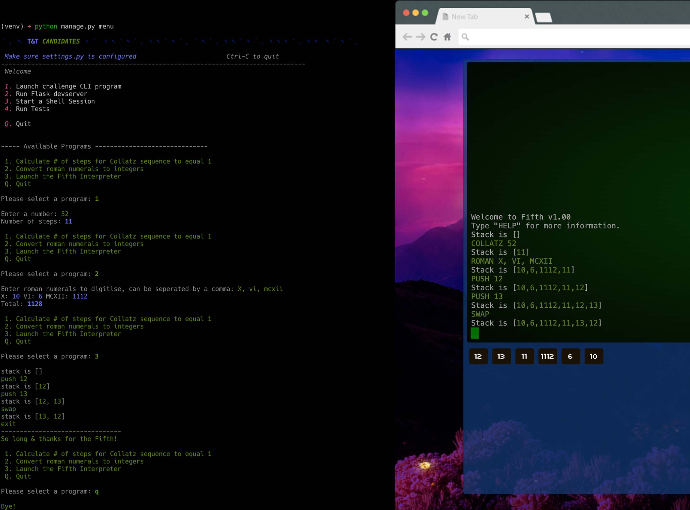

# Quickstart

This project contains both CLI and Flask interfaces to the problems detailed below.

**To run the CLI program** (no dependencies required):  
```
python3 ./
```

**To run the program launcher** (the program will prompt you to automatically create a virtualenv & install requirements):  
```
python3 manage.py menu
```

**To run the flask app**:  
```
python manage.py runserver
```

**To run the test suite**:  
```
(venv) python manage.py test # or simply `pytest` 
(venv) python manage.py coverage # to generate a html coverage report in PROJECT_ROOT/htmlcov
```

<div align="center">
<br/>
</div>

## Problems

### 1. The Collatz conjecture

The Collatz, or 3n + 1 conjecture, is a mathematical sequence defined as follows:

* start with a number, n
* if n is even:
  * produce n / 2
* otherwise, n is odd:
  * produce 3 * n + 1
* repeat until n is 1

Write a python program which takes a numeric input and shows how many steps it takes until the Collatz
sequence reaches 1.

### 2. Roman Numerals

Roman numerals are a sequence of characters used for counting, and for recording what number sequel a movie is.
Valid roman numerals are:

| numeral | value |
| ------- | ----- |
| I       | 1     |
| V       | 5     |
| X       | 10    |
| C       | 100   |
| M       | 1000  |

Roman numerals are written by expressing each digit separately starting with the left most digit:

```
X = 10
VI = 5 + 1 = 6
MXVII = 1000 + 10 + 5 + 1 + 1 = 1017
```

There are some other rules around roman numerals which we don't currently care about.

Write a python program which takes a series of roman numerals as input and which outputs their value as a number.

### 3. Stack

Fifth is a new stack-based language. A stack is a data structure which can only have elements added to the top.
Fifth stores a stack of integers and supports commands to manipulate that stack. 
Operations always apply to the top of the stack.

Fifth supports the following arithmetic operators:

```
+ - * /
```

Each of these applies the operator to the two values on the top of the stack and pushes the
result to the top of the stack. If division results in a non-integer, round down.

Fifth also supports the following commands:

* `PUSH x` - push x onto the top of the stack, where x is a valid integer
* `POP` - remove the top element of the stack
* `SWAP` - swap the top two elements of the stack
* `DUP` - duplicate the top element of the stack

Write a python program which works as a fifth interpreter. Each line of input to the program should
represent a single fifth command. Output the result of each command to the terminal. Handle errors sensibly.

Example:

`stack is []`  
`PUSH 3`  
`stack is [3]`  
`PUSH 11`  
`stack is [3, 11]`  
`+`  
`stack is [14]`  
`DUP`  
`stack is [14, 14]`  
`PUSH 2`  
`stack is [14, 14, 2]`  
`*`  
`stack is [14, 28]`  
`SWAP`  
`stack is [28, 14]`  
`/`  
`stack is [2]`  
`+`  
`ERROR`  
